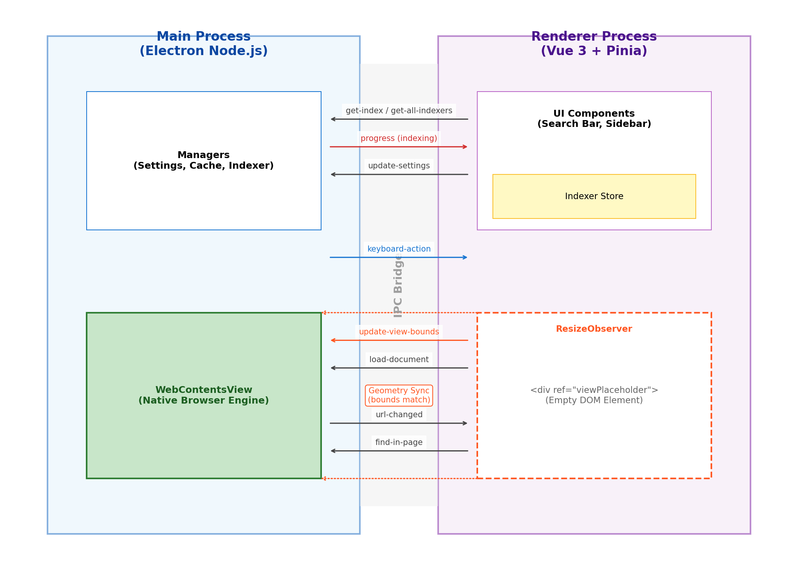

Chemrtron
=========

A document viewer with fuzzy match incremental search, built on Electron.

Chemrtron is the modern implementation of Chemr, designed for high-speed documentation access with a unified interface.

Project Naming
--------------

*   **Chemrtron**: The project codename and repository name for this Electron-based implementation.
*   **Chemr**: The product name. The application executable and system identity use this name.
*   **~/.chemr**: The configuration and cache directory used by the application.

Features
========

*   **On-demand Indexing**: Create and update search indexes for various documentation sets.
*   **Incremental Search**: Fast, fuzzy-match search across all your enabled documents.
*   **Unified UI**: A consistent experience whether you're browsing MDN, Node.js docs, or custom sets.
*   **System Integration**: Supports system light/dark modes and global shortcuts.
*   **WebContentsView**: Uses Electron's modern view system for seamless document rendering alongside the search UI.

Creating New Indexers
=====================

Indexers are simple JavaScript files that define how to crawl and index a documentation site.

*   **Built-in Indexers**: Located in `src/indexers/`. These are bundled with the application and synchronized to `~/.chemr/builtin-indexers/` at runtime.
*   **User Indexers**: Can be placed in `~/.chemr/indexers/` for personal use.

Example indexer structure:

```javascript
export default {
  id: 'my-docs',
  name: 'My Documentation',
  color: '#42b883',
  testSpec: {
    expectedSymbols: ['MyMainFunction'],
    minEntries: 10
  },
  async index(ctx) {
    // Use ctx.fetchDocument, ctx.pushIndex, etc.
  }
}
```

Development
===========

### Requirements

*   [Node.js](https://nodejs.org/) (Latest LTS recommended)
*   npm or yarn

### Setup

```bash
# Clone the repository
git clone https://github.com/cho45/Chemrtron.git
cd Chemrtron

# Install dependencies
npm install
```

### Run in Development

```bash
npm run dev
```

### Updating Indexers

Built-in indexers (in `src/indexers/`) are synchronized to `~/.chemr/builtin-indexers/` when the application starts.

If you modify files in `src/indexers/` and want to apply the changes immediately during development without restarting the app, run the following command:

```bash
npm run sync-indexers
```

### Testing Indexers

You can run a live health check for built-in indexers. This script connects to the actual documentation sites to verify that the indexing logic still works against the current remote content.

```bash
# Test all indexers
npx tsx test/indexers/live-runner.ts

# Test a specific indexer (less load on remote sites)
npx tsx test/indexers/live-runner.ts lua
```

The runner verifies:
- Connection and retrieval of documentation pages.
- Minimum number of extracted entries.
- Presence of essential symbols (e.g., `print` for Lua).
- Validity of generated URLs (no double slashes, starts with `https://`).

Architecture
============

Chemrtron uses a modern Electron architecture leveraging `WebContentsView` for high-performance document rendering.



### Process Model

*   **Main Process**: Handles window management, system settings, global shortcuts, and executes indexers. It also manages the `WebContentsView` lifecycle and bounds.
*   **Renderer Process (Vue 3 + Pinia)**: Renders the application UI (sidebar, search panel, modals). It communicates user intent to the Main process.
*   **Communication**: Strictly typed IPC channels defined in `src/shared/types.ts`.

### WebContentsView Integration

Chemrtron uses `WebContentsView` (the successor to `BrowserView`) to render external documentation. This ensures that heavy documentation pages do not affect the performance of the search UI and provides native scroll/navigation behavior.

**Layout Strategy:**
1.  **Placeholder Element**: The Vue renderer places a `<div class="view-placeholder">` element in the layout where the documentation should appear.
2.  **Geometry Sync**: A `ResizeObserver` monitors this placeholder. Whenever its size or position changes, the renderer sends the new bounds to the Main process via IPC (`update-view-bounds`).
3.  **Native Resizing**: The Main process resizes the `WebContentsView` to match the placeholder's coordinates exactly.

**UI Design Implications:**
Since `WebContentsView` is a native surface rendered *independently* of the HTML DOM, it is difficult to overlay HTML content (like a floating search bar) on top of it.
*   **Sidebar Search**: To avoid z-index conflicts, the search interface is designed as a persistent sidebar that "pushes" the content view aside, rather than floating over it.
*   **Modals**: When a full-screen modal (e.g., Settings) is opened, the application explicitly hides the `WebContentsView` to allow the HTML modal to be visible.

Key Components:
- `src/main`: Main process logic (settings, cache, indexers).
- `src/renderer`: Vue-based search and settings UI.
- `src/shared`: Shared types and the fuzzy search algorithm.
- `src/indexers`: Built-in indexer definitions.

Build
=====

To build the application for your current platform:

```bash
npm run build
```

This uses `electron-builder` to generate production-ready packages in the `dist` directory.

Release
=======

Releases are automated via GitHub Actions. To publish a new version:

```bash
# This will bump the patch version, create a git tag, and push to GitHub
npm run release
```

The GitHub Action will automatically:
- Build the application for Windows, macOS, and Linux.
- Create a new GitHub Release.
- Upload the installers and binaries to the release.
- Generate release notes based on commit history.

**Note for macOS users:** Since the app is not signed with an Apple Developer certificate, macOS may report that the app "is damaged and can't be opened" after downloading. To fix this, move the app to your `/Applications` folder and run the following command in your terminal:

```bash
sudo xattr -rd com.apple.quarantine /Applications/Chemrtron.app
```

Then you can open the app normally (you may still need to **Right-click and select "Open"** for the first time).

License
=======

MIT